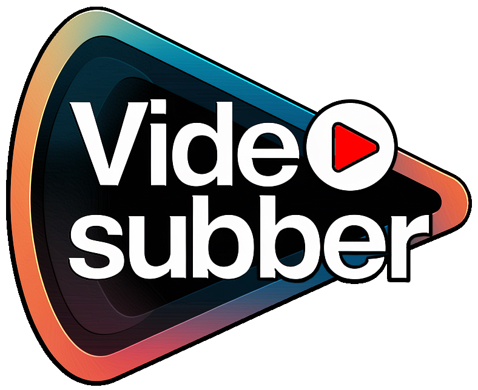
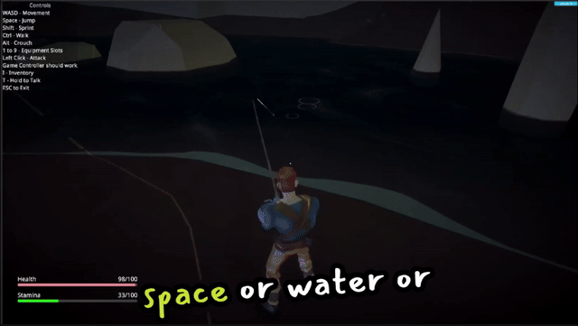

# VideoSubber



VideoSubber automates the addition of subtitles to videos, enhancing accessibility for diverse audiences.

## Features

- **Automated Subtitle Generation**: Transcribes and embeds subtitles into videos.
- **User-Friendly Interface**: Intuitive design for seamless operation.
- **High Accuracy**: Employs advanced algorithms for precise transcriptions.

## Demo



*Example output from Videosubber*

## Getting Started

### Prerequisites

- Install docker on your machine.  Windows users will want Docker Desktop, which is simple to install.\
  If you can open a command prompt and get valid output from the `docker ps` command, you are good to go.

### Installation

1. **Clone the Repository**:
   ```bash
   git clone https://github.com/yourusername/videosubber.git
   ```
2. **Navigate to the Project Directory:**

   Simply double-click `run.bat` and the server will run in a command window, while a browser will pop up and attempt to connect to it.  This takes a moment for the server to start up, so click reload in the browser when it looks ready.

### Usage

1. **Select Your Video File**: This opens a file picker window on your local machine.  Any file format is accepted.
2. **Select Your Subtitles File:** This opens a file picker window on your local machine.  Choose an `.srt` format file with subtitles timed for your video.  If you don't have one of these and want one, there are lots of automatic subtitle generators now.  Windows 11 users have ClipChamp already installed, and can auto-generate them and edit them for free.
3. **Add Fonts:** Videosubber does not come with any fonts.  Copy any `.ttf` or `.otf` font file into the `/app/fonts` folder at any time, and refresh your browser window to pick them up.
4. **(Optional) Add Live Preview Images:** Copy any images into the `/app/images` folder at any time to see them occasionally pop up in the live preview window.
5. **Adjust Subtitle Settings:** Anytime a control is adjusted, the server generates a new example of what your subtitles will look like on a random image.
6. **Generate Video**: This uploads your video and subtitle files to the local server, then automatically downloads a fully subtitled file in the same video format you uploaded.


*Random clicking*

## Contributing

If you add cool features, send me a pull request. I'm busy a lot, but I would like to see this get better.

We welcome contributions! Please:

1. Fork the repository.
2. Create a new branch (`git checkout -b feature/YourFeature`).
3. Commit your changes (`git commit -m 'Add YourFeature'`).
4. Push to the branch (`git push origin feature/YourFeature`).
5. Open a Pull Request.

## License

This project is licensed under the very friendly [MIT No Attribution License](LICENSE).

## More Words

- ffmpeg - you power the internet

If you like this tool, please come check out the game project I'm leading called Mooncast Online at https://mooncast.productions/ and join our Discord.  It's a small indie team of veteran game devs building a deep survival crafting MMO.
